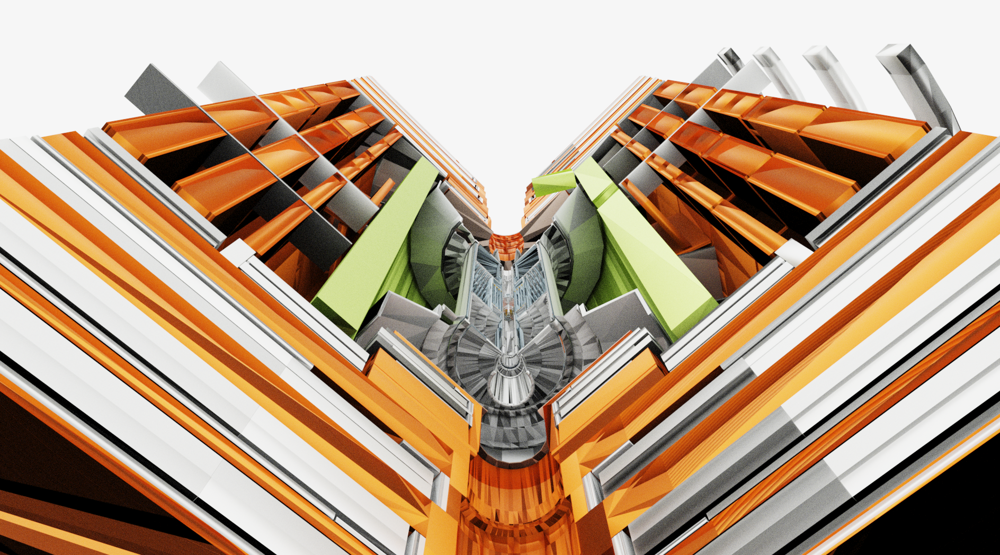
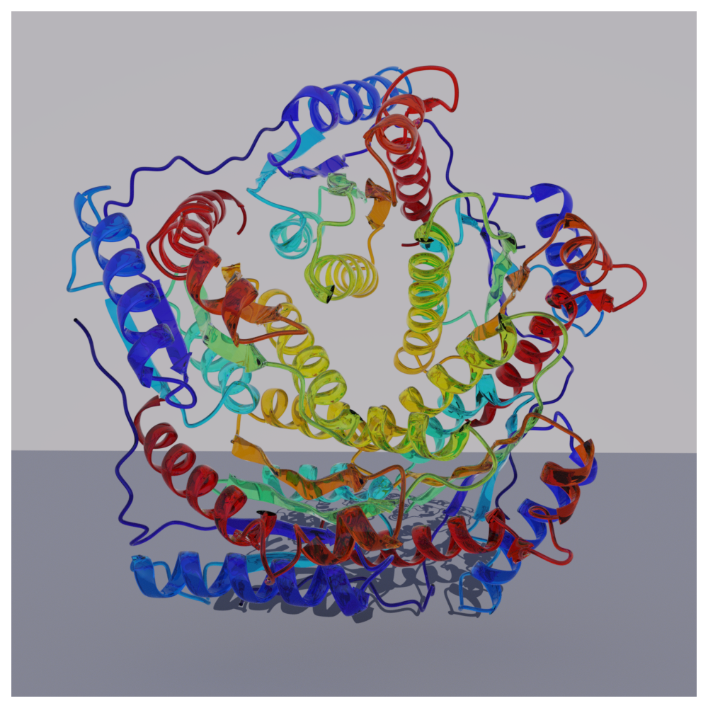
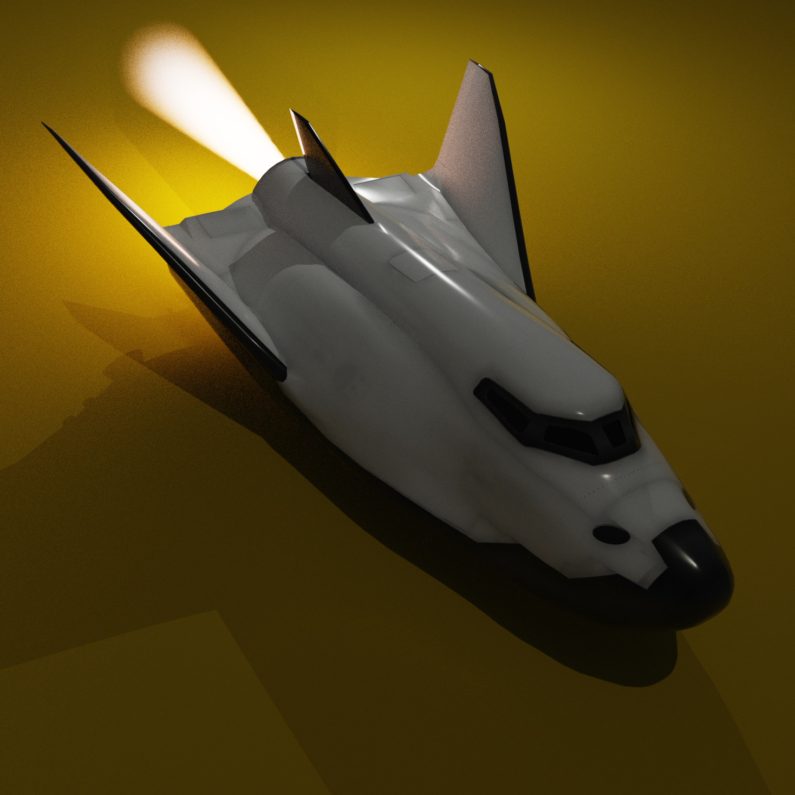

# RayDemo

Demo scenes for [TraceMakie](https://github.com/MakieOrg/Makie.jl/tree/sd/hikari/TraceMakie) and [Hikari](https://github.com/pxl-th/Trace.jl), physically-based ray tracing in Julia. Each folder contains self-contained scripts that set up a scene and render it with spectral path tracing on GPU (AMD ROCm via AMDGPU.jl).

## Setup

All dependencies are pinned in `Project.toml`. Several packages come from development branches:

```julia
julia --project=.
using Pkg; Pkg.instantiate()
```

Rendering requires an AMD GPU with ROCm support. To use CUDA instead, replace `AMDGPU.ROCBackend()` with `CUDA.CUDABackend()` in the scripts.

---

## Black Hole


**Script:** [`BlackHole/black_hole.jl`](BlackHole/black_hole.jl)

Volumetric ray tracing of a black hole with accretion disk. A custom Hikari `Medium` subtype (`SpacetimeMedium`) bends light rays according to the Schwarzschild metric. The accretion disk density field is generated procedurally with spiral arms, particle streams, and a photon ring.

---

## Volumetric Clouds


**Scripts:** [`Volumes/cloud_bomex.jl`](Volumes/cloud_bomex.jl) | [`Volumes/bunny_cloud.jl`](Volumes/bunny_cloud.jl) | [`Volumes/terrain.jl`](Volumes/terrain.jl)

Volumetric path tracing of cloud data. `cloud_bomex.jl` renders LES cloud data from Oceananigans.jl BOMEX simulations in Disney Cloud style. `bunny_cloud.jl` renders the Stanford bunny cloud from pbrt-v4-scenes using NanoVDB. `terrain.jl` combines real elevation data (via Tyler.jl) with cloud volumes for a rayshader-style landscape.

**Data:** `bomex_1024.nanovdb` (generate with `convert_bomex.jl`), `bunny_cloud.nvdb` (from [pbrt-v4-scenes](https://github.com/mmp/pbrt-v4-scenes)).

---

## Water Splash

[](https://youtu.be/SZwlpfda5jo)

**Script:** [`Trixi/water_splash.jl`](Trixi/water_splash.jl)

Ray-traced animation of a ball splashing into water, using fluid simulation data from TrixiParticles.jl. Glass material with IOR 1.33 provides realistic water refraction and caustics. A custom VTK parser loads legacy binary surface meshes per frame.

**Data:** Only frame-0 VTK files are included in the repo. The full simulation (~40 GB) can be generated with [TrixiParticles.jl](https://github.com/trixi-framework/TrixiParticles.jl).

---

## Smoke Wake

[](https://youtu.be/iGltG8fM2K8)

**Script:** [`Waterlily/smoke_wake.jl`](Waterlily/smoke_wake.jl) | [`Waterlily/waterlily_simulation.jl`](Waterlily/waterlily_simulation.jl)

Volumetric rendering of a sphere wake from WaterLily.jl LES simulation, visualized as realistic smoke using `RGBGridMedium` with a colormap. Vorticity magnitude drives the smoke density, and in-place density updates enable efficient animation without scene rebuilds.

**Data:** Simulation snapshots in `sim/` (~2 GB) are not included. Run `waterlily_simulation.jl` to generate them.

---

## Boids Flocking

https://github.com/user-attachments/assets/boids_flocking.mp4

**Script:** [`Ark/boids_flocking.jl`](Ark/boids_flocking.jl)

Ray-traced flocking simulation using the Ark.jl Entity Component System. Gold metallic spheres swirl through space following separation, alignment, and cohesion rules. Ark ECS drives the simulation on CPU with a spatial hash grid; TraceMakie renders each frame with path tracing on GPU.

---

## CMS Detector



**Script:** [`Geant4/cms_detector.jl`](Geant4/cms_detector.jl)

Ray-traced visualization of the CMS (Compact Muon Solenoid) particle detector at CERN, loaded from GDML geometry files via Geant4.jl. A quadrant cut reveals internal structure. Detector elements are mapped to physically-based metal materials (gold, copper, silver, aluminum, iron). Meshes are generated from Geant4's tessellated polyhedra with crease-angle vertex splitting for smooth normals on curved surfaces.

**Attribution:** CMS detector geometry: CERN, via [Geant4.jl](https://github.com/JuliaHEP/Geant4.jl).

---

## Protein Structures




**Scripts:** [`ProtPlot/protein_ribbon.jl`](ProtPlot/protein_ribbon.jl) | [`ProtPlot/protein_glass.jl`](ProtPlot/protein_glass.jl) | [`ProtPlot/protein_7pkz.jl`](ProtPlot/protein_7pkz.jl) | [`ProtPlot/protein_gold.jl`](ProtPlot/protein_gold.jl) | [`ProtPlot/protein_trajectory.jl`](ProtPlot/protein_trajectory.jl)

Ray-traced protein ribbon diagrams using ProtPlot.jl with various materials: glass, coated diffuse with depth of field, and gold. `protein_trajectory.jl` animates a protein folding trajectory. Protein structures are fetched from the Protein Data Bank (PDB: 1HQK, 7PKZ).

**Attribution:** [ProtPlot.jl](https://github.com/MurrellGroup/ProtPlot.jl) by Ben Murrell; structures from [RCSB PDB](https://www.rcsb.org/).

---

## GLTF Models




**Scripts:** [`GLTF/drone_christmas.jl`](GLTF/drone_christmas.jl) | [`GLTF/spacecraft.jl`](GLTF/spacecraft.jl)

Ray-traced rendering of GLTF/GLB 3D models. `drone_christmas.jl` renders a Christmas tree with glowing emissive decorations and a hovering drone in a room scene. `spacecraft.jl` renders an HL-20 spacecraft with a volumetric rocket exhaust plume.

**Attribution:** Christmas tree from [Sketchfab](https://sketchfab.com/3d-models/25k-followers-christmas-special-1fd1cdc4c2d94ecfa8d80a25f1818e8c); quadcopter and HL-20 spacecraft models provided by [JuliaHub](https://juliahub.com).

---

## Oil Palm Plants


**Script:** [`Plants/plants.jl`](Plants/plants.jl)

Ray-traced oil palm rendered from a biophysically accurate plant architecture (Multi-scale Tree Graph) generated by XPalm.jl. PlantGeom.jl provides the geometry with subsurface scattering leaf materials and sun-sky lighting.

**Attribution:** [PlantGeom.jl](https://github.com/VEZY/PlantGeom.jl) and [XPalm.jl](https://github.com/PalmStudio/XPalm.jl) by Remi Vezy, CIRAD.
